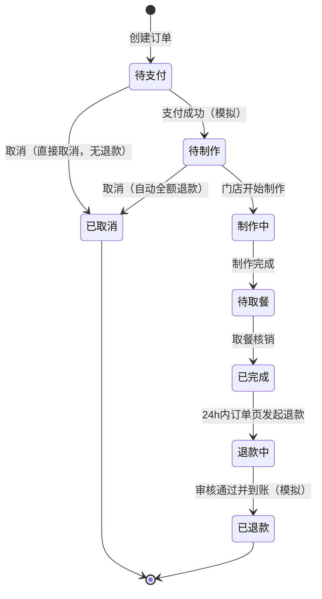
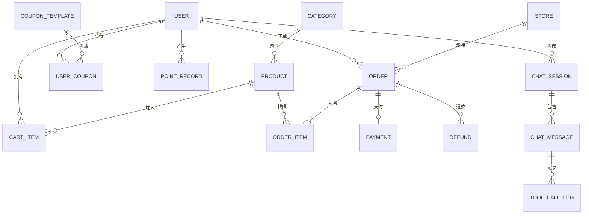

# Atlantic Coffee 智能客服系统 · 产品需求分析

| 文档信息 | 说明 |
|----------|------|
| 所属阶段 | 一、产品需求分析 |
| 版本 | v1.1 |
| 日期 | 2026-09-27 |

**修订记录**

| 版本 | 日期 | 说明 |
|------|------|------|
| v1.0 | 2026-09-27 | 初稿 |
| v1.1 | 2026-09-27 | 按评审意见修订：更新对标定位；AI 退款能力降级为只读；补充订单状态机；账号体系统一为 user 表 + role；催单降级为预计时间查询；性能指标改用 P95 并区分场景；新增核心数据实体初稿（详见决策记录 #11–#17） |

---

## 1. 项目定位与目标

- **定位**：求职作品集项目——对标**瑞幸小程序**与 **Pacific Coffee（PacificCoffeeHK）** 的咖啡点单 Web 应用，并在此基础上**添加 AI 智能客服功能**。
- **叙事目标**：完整展现"模糊想法 → 需求分析 → 技术决策 → 架构设计 → 编码实现"的工程收敛过程，每个阶段产出一份 .md 决策文档。
- **技术主线**：Spring Boot + Spring AI Alibaba（阿里云百炼/通义），AI 客服具备 RAG 知识问答 + 工具调用（查询真实业务数据）双能力。

## 2. 目标用户与角色

- **C 端顾客（role=USER）**：浏览菜单、下单点咖啡、查询订单、发起取消/退款、咨询售后与会员权益的普通消费者（Web 端，PC/移动自适应）。
- **店铺运营人员（role=ADMIN）**：使用知识库管理后台维护菜单、活动、FAQ 语料的内部角色。**与 C 端用户共用同一张 user 表，通过 role 字段区分**，不建立独立账号体系。
- **人工客服（role=AGENT，模拟坐席）**：AI 无法解决时的兜底承接方，MVP 中以模拟实现呈现，同样复用 user 表。
- **评审者（面试官/观众）**：通过演示与文档理解系统。作品集定位决定了**可演示性与文档质量是硬性要求**。

## 3. 功能需求

### 3.1 业务系统（点单应用）——MVP 必须

| 模块 | 功能点 |
|------|--------|
| 用户 | 手机号+密码（模拟验证码）注册/登录，JWT 会话，个人中心；全角色共用 user 表，role 字段区分 USER / ADMIN / AGENT |
| 菜单 | 分类浏览、单品详情（描述/价格/规格：温度·糖度·冰度） |
| 购物车 | 添加/修改数量/删除/清空 |
| 下单 | 选择门店与取餐方式、确认订单、模拟支付（免接入真实支付） |
| 订单 | 订单列表/详情、状态流转（见 3.4 状态机）、取消订单（限状态机允许的状态）、发起退款（限状态机允许的状态，订单页自助操作） |
| 会员 | 积分账户（下单得积分）、优惠券（领券/下单抵扣）、会员等级展示 |

### 3.2 AI 客服——MVP 必须

- **网页聊天窗口**：浮动入口进入，打字机流式输出，多轮上下文记忆，支持会话历史。
- **RAG 知识问答**：基于知识库（菜单、活动规则、会员规则、FAQ、品牌信息）回答，答案可溯源。
- **工具调用（Function Calling，均为只读查询）**：
  - 查询我的订单 / 订单状态
  - 查询订单预计完成时间
  - 查询退款进度
  - 查询积分 / 查询优惠券
  - 门店信息查询
  - 饮品个性化推荐
- **写操作边界**：AI 不直接执行取消订单、退款等写操作，仅提供规则解答与操作指引（跳转业务系统订单页完成），控制资金相关操作的风险面（见决策 #12、#15）。
- **人工转接**：AI 判断无法解决或用户主动要求时转接模拟人工坐席，支持会话交接上下文摘要。
- **知识库管理后台**：文档/语料的增删改查，变更后同步更新向量索引。
- **安全兜底**：回答不了不编造；用户身份校验，AI 仅能查询登录用户本人的数据。

### 3.3 用户意图分类（AI 客服处理范围）

| 意图大类 | 细分意图 | 处理方式 |
|----------|----------|----------|
| 下单前咨询 | 饮品推荐（按口味/场景/预算）、单品详情（配料/糖度冰度/价格/过敏原）、优惠活动咨询、点单流程咨询 | RAG + 推荐工具 |
| 订单与售后 | 订单状态查询、取餐码与预计完成时间查询（催单仅查询，不做真实写操作）、退款规则问答、退款进度查询、取消订单操作指引（跳转业务系统） | 工具调用 + RAG |
| 会员与权益 | 积分查询与规则、优惠券查询与使用规则、会员等级权益 | 工具调用 + RAG |
| 门店与其他 | 门店位置/营业时间、咖啡知识/品牌故事、闲聊寒暄 | 工具调用 + RAG |
| 兜底 | 超出范围/敏感/无法理解的问题 | 兜底话术 → 转人工 |

### 3.4 订单状态机

订单全生命周期共 6 个状态，各状态下"取消 / 退款"的可用性如下：

| 状态 | 用户可执行操作 | 取消 | 退款 | 规则说明 |
|------|----------------|------|------|----------|
| 待支付 | 支付、取消订单 | ✅ 直接取消 | — | 未支付，取消不涉及退款 |
| 待制作 | 取消订单 | ✅ | ✅ 自动全额退款 | 已支付未制作，取消即触发全额退款 |
| 制作中 | 查看进度 | ❌ | ❌ | 如有特殊情况可转人工客服沟通 |
| 待取餐 | 查看取餐码、预计完成时间 | ❌ | ❌ | 门店已出餐或即将出餐 |
| 已完成 | 发起退款申请 | — | ✅ 订单页自助发起 | 仅限完成后 24 小时内（售后窗口） |
| 已取消 / 已退款 | — | 终态 | 终态 | 允许基于原订单重新下单（M1 可不做） |

退款单自身状态流转：**申请中 → 已通过（退款中）→ 已到账 / 已拒绝**。MVP 环境下审核采用**模拟自动通过**（不建管理员审核界面），申请到到账的模拟节奏（如延迟 30 秒）在详细设计阶段确定。

AI 客服在上述任何状态下都**只做查询与指引**：可回答"现在能不能取消/退款、为什么、去哪里操作、退款进度如何"，不代替用户执行。

## 4. MVP 范围与迭代规划

### 4.1 MVP（第一期）

完整点单流程 + AI 客服（RAG、只读工具调用、流式输出、多轮记忆）+ 知识库管理后台 + 人工转接（模拟坐席）+ 模拟手机号登录。

实现顺序上内部再分两步交付，降低一次性交付风险：

- **M1（业务闭环 + AI 基础对话）**：点单全流程（含状态机、取消、退款发起）、登录体系、聊天窗口、RAG 问答、流式输出与多轮记忆。
- **M2（AI 进阶能力）**：只读工具调用（订单/预计完成时间/退款进度/积分/券/门店/推荐）、知识库管理后台、人工转接。

### 4.2 后续迭代（本期明确不做）

| 功能 | 暂缓原因 |
|------|----------|
| AI 执行写操作（发起退款、代替取消订单等） | 资金相关写操作风险高，需引入确认链路与审计，MVP 先只读 |
| 回答反馈机制（点赞点踩、未解决标记） | 需要数据闭环积累，价值在长线运营 |
| 自动化评测流水线 | MVP 先以人工评测集验证，工具化属锦上添花 |
| 真实第三方登录 | 个人开发者资质受限 |
| 语音交互 | 与客服核心链路无关 |
| AI 主动营销（如智能发券） | 超出"客服"范畴 |
| 真实支付接入 | 个人项目无法签约，模拟支付即可完成闭环 |

## 5. 量化成功指标（评测思路）

| 指标 | 目标 | 度量方式 |
|------|------|----------|
| 意图识别准确率 | ≥ 90% | 标注评测集（50–100 条典型问题）人工核对 |
| 知识问答准确率 | ≥ 85% | 评测集答案与知识库事实比对 |
| 工具调用成功率 | ≥ 95% | 调用日志统计（参数正确、执行成功） |
| 首次响应时长（纯对话，无工具调用） | 首 token P95 < 3s | 流式输出埋点 |
| 首次响应时长（含工具调用） | 首 token P95 < 6s（含工具执行耗时） | 流式输出埋点 |
| 普通业务接口耗时 | P95 < 500ms | 接口监控 |
| 自助解决率 | ≥ 70% | 未转人工且正常结束的会话占比 |
| 转人工率 | 可观测即可 | 会话统计 |

评测集随本阶段建立并纳入文档管理，作为后续每次 prompt/检索策略优化的回归基准。

## 6. 非功能需求（需求层面）

- **性能**：AI 纯对话首 token P95 < 3s；含工具调用首 token P95 < 6s；普通页面接口 P95 < 500ms。
- **安全**：JWT 鉴权；AI 工具调用走鉴权后的用户上下文，严禁越权查询他人订单/积分；知识库后台需 ADMIN 角色权限。
- **可观测**：会话日志、工具调用日志落库，支撑指标统计与问题排查。
- **可演示**：一键本地启动 + 种子数据（演示账号、菜单、订单），支持流畅完整演示。

## 7. 核心数据实体（初稿）

> 字段级设计与范式取舍在"详细设计"阶段敲定，本节只锁定实体边界与关系，作为总体设计的数据模型起点。

| 实体 | 说明 | 关键字段（示意） |
|------|------|------------------|
| user 用户 | 全角色共用一张表 | 手机号、密码、昵称、**role（USER/ADMIN/AGENT）**、会员等级 |
| category 商品分类 | 咖啡/非咖/烘焙等 | 名称、排序、状态 |
| product 商品 | 菜单单品 | 名称、描述、基础价、图片、状态、所属分类 |
| spec_option 规格选项 | 温度/糖度/冰度字典 | 规格组、选项名、差价 |
| cart_item 购物车项 | 用户待下单商品 | 用户、商品、**规格快照**、数量 |
| store 门店 | 虚构门店 | 名称、地址、营业时间、电话、状态 |
| order 订单 | 交易主单 | 订单号、用户、门店、**状态（3.4 状态机）**、取餐方式、取餐码、预计完成时间、金额 |
| order_item 订单明细 | 订单内商品行 | **商品与规格快照**、数量、单价 |
| payment 支付记录 | 模拟支付流水 | 订单、金额、渠道（模拟）、状态 |
| refund 退款单 | 售后退款 | 订单、金额、原因、**状态（申请中/已通过/已拒绝/已到账）** |
| coupon_template 优惠券模板 | 券规则定义 | 名称、门槛、面额、有效期规则 |
| user_coupon 用户优惠券 | 用户持券实例 | 用户、模板、状态（未使用/已使用/已过期） |
| point_record 积分流水 | 积分变动明细 | 用户、变动值、类型（获得/抵扣）、关联订单、变动后余额 |
| chat_session AI 会话 | 一次客服会话 | 用户、状态（AI 服务中/已转人工/已结束）、承接坐席 |
| chat_message 会话消息 | 会话内消息 | 会话、角色（用户/AI/坐席/系统）、内容、工具调用引用 |
| tool_call_log 工具调用日志 | 只读工具执行记录 | 消息、工具名、入参、出参、是否成功、耗时 |
| kb_document 知识库文档 | RAG 语料 | 类型（菜单/活动/会员规则/FAQ/品牌）、标题、内容、状态、版本；向量化分块方案在技术栈阶段定 |

## 8. 内容素材规划（由 AI 协助虚构全套）

- **品牌设定**：Atlantic Coffee 品牌故事与调性（海洋/探索主题）。
- **菜单**：约 25 个 SKU（经典咖啡、奶咖、特调/果咖、非咖啡饮、烘焙小食），含描述与规格定价。
- **门店**：6 家虚构门店（地址、营业时间、联系电话）。
- **活动**：2–3 个进行中营销活动及优惠券规则。
- **会员规则**：积分获取/抵扣规则、3 级会员等级与权益。
- **FAQ**：30+ 条常见问答，作为 RAG 语料主体。

## 9. 需求决策记录（收敛过程存档）

> 记录从模糊想法到明确需求的关键问答，供后续阶段回溯决策依据。

| # | 问题 | 决策 | 理由 |
|---|------|------|------|
| 1 | 项目定位是什么？ | 求职作品集 | 要求接近真实产品、可演示、能体现工程决策过程 |
| 2 | 部署在什么渠道？ | 网页聊天窗口 | 开发与演示成本最低，可做出完整体验 |
| 3 | 覆盖哪些客服场景？ | 售前咨询、订单售后、会员权益、门店其他，四类全要 | 对齐瑞幸 AI 客服的完整场景面 |
| 4 | 基础业务功能做到什么程度？ | 完整点单流程 | AI 查订单/积分等能力依赖真实业务数据，完整业务让 AI 能力"有据可查" |
| 5 | AI 能力深度？ | RAG + 工具调用双能力 | 作品集最核心的技术卖点 |
| 6 | 底层大模型？ | 阿里云百炼/通义 | Spring AI Alibaba 官方适配，中文客服效果好 |
| 7 | 登录体系？ | 模拟手机号登录 + JWT | 支撑个性化查询场景，真实感与可行性平衡 |
| 8 | MVP 亮点功能取舍？ | 流式输出+多轮记忆、知识库后台、人工转接进 MVP；反馈机制延后 | 优先保证核心体验与完整客服闭环 |
| 9 | 内容素材来源？ | 由 AI 协助虚构全套 | 虚构品牌无现成素材 |
| 10 | 是否定义量化指标？ | 定义 | 支撑"如何评估 AI 客服效果"的面试叙事 |
| 11 | 对标对象是谁？（v1.1） | 瑞幸小程序 + Pacific Coffee HK，并添加 AI 客服 | 双参照：移动点单体验对标瑞幸，连锁品牌服务形态参考 Pacific Coffee |
| 12 | AI 能否直接发起退款？（v1.1） | 降级为"退款规则问答 + 退款进度查询"，发起退款留在业务系统订单页 | 资金类写操作风险高，MVP 阶段 AI 严格只读，控制风险面 |
| 13 | 售后规则的前提是什么？（v1.1） | 补充订单状态机（6 状态），明确每个状态下取消/退款可用性 | 没有状态机，"能不能取消/退款"的问答无从依据 |
| 14 | 运营账号怎么管理？（v1.1） | 运营/坐席与 C 端用户共用 user 表 + role 字段（USER/ADMIN/AGENT） | 个人项目规模下，独立账号体系是过度设计 |
| 15 | "催单"怎么实现？（v1.1） | 降级为查询预计完成时间，不做真实写操作 | 真实催单涉及门店作业系统，超出 MVP 范围 |
| 16 | 首响应指标怎么定？（v1.1） | "首 token < 2s" 改为 P95 口径：纯对话 < 3s、含工具调用 < 6s | P95 比单点值更严谨；工具调用耗时需独立预算，两者不可混为一谈 |
| 17 | 数据模型从哪起步？（v1.1） | 新增"核心数据实体（初稿）"节，锁定 17 个实体及关系 | 为总体设计提供数据模型起点，避免设计阶段从零开始 |

---

**下一步**：进入阶段二"技术栈确定"，产出 `docs/02-技术栈选型.md`。
