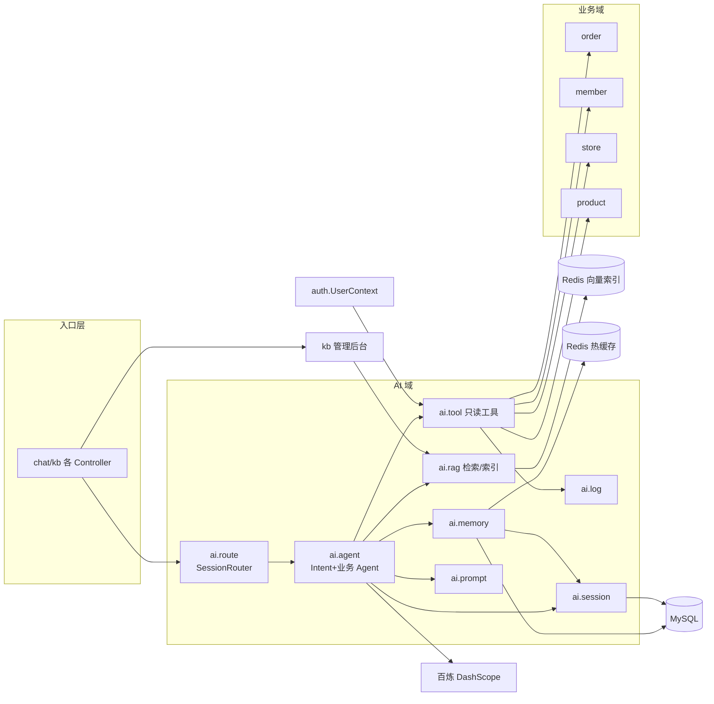
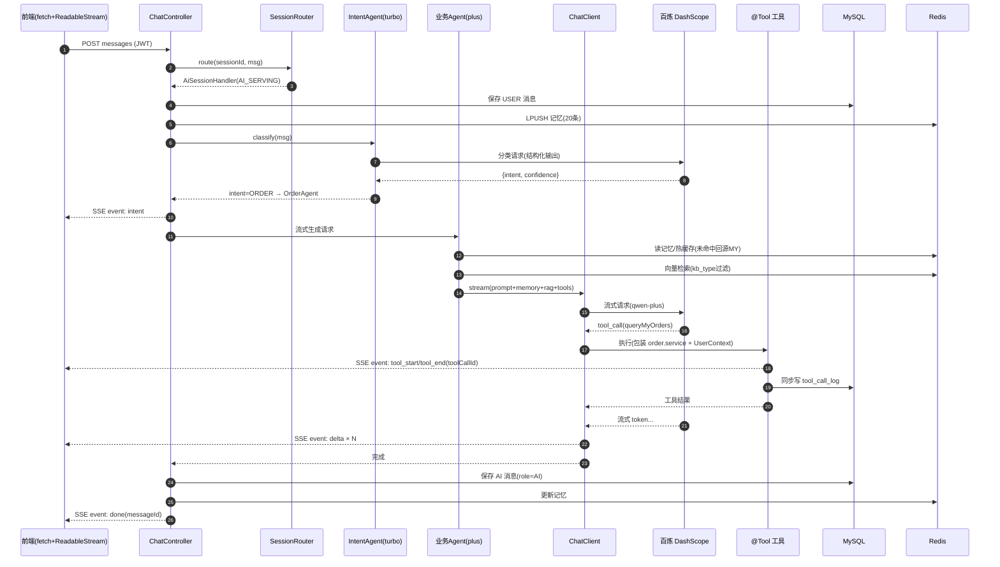
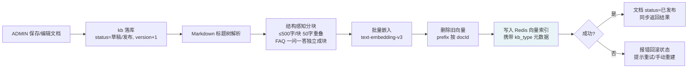
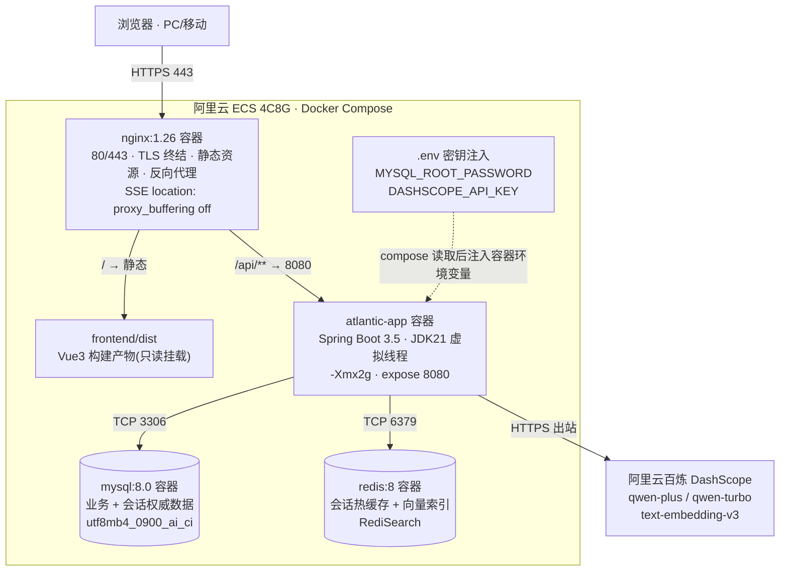

# Atlantic Coffee 智能客服系统 · 总体设计

| 文档信息 | 说明 |
|----------|------|
| 所属阶段 | 三、总体设计 |
| 版本 | v1.1 |
| 日期 | 2026-09-27 |
| 上游文档 | `docs/01-产品需求分析 v1.2.md`（PRD v1.2）、`docs/02-技术栈选型 v1.2.md`（v1.2） |

**修订记录**

| 版本 | 日期 | 说明 |
|------|------|------|
| v1.0 | 2026-09-27 | 初稿：模块划分、双层路由澄清、AI 完整调用链路与数据流图、多 Agent 定义与 System Prompt 初稿、接口契约草案、部署架构图、预留项对齐核对表（决策 #37–#41） |
| v1.1 | 2026-09-27 | 六项修正：① 包名全局改为 `com.zmh.atlantic.coffee`；② RouterAgent 更名 **IntentAgent**（消除与 SessionRouter 的命名接近性，含常量名 ROUTER_CLASSIFIER_PROMPT→INTENT_CLASSIFIER_PROMPT）；③ SSE error 事件增加 retryable 字段与前端行为定义；④ tool_start/tool_end 事件增加 toolCallId（并行工具调用按其配对）；⑤ 错误码 50002 补充 SSE 建立前/后的错误呈现边界；⑥ 部署图 ENV 连线标签改为 compose 注入语义。附带：上游文档引用更新为版本化文件名 |

---

## 1. 设计总览与原则

1. **模块化单体**：一个 Spring Boot 应用内以包为边界划分模块，模块间依赖方向单向可控。全文档不出现服务拆分、消息队列、注册中心等分布式概念（技术栈 §12.3 排除清单继续生效）。
2. **双层路由分层清晰**：会话级"服务方路由"（SessionRouter，PRD 预留）与消息级"意图路由"（IntentAgent，本次新增）是两个不同层次，职责互斥，§3.1 专门澄清。
3. **AI 只读边界贯穿**：全部 7 个工具只读；写操作（取消/退款/下单）只存在于业务系统接口，Agent 只做查询与指引（PRD 决策 #12、#15）。
4. **预留项全量对齐**：PRD v1.2 的人工转接三层预留（枚举 / SessionRouter / 前端 role 多分支）在本文档的包结构、调用链、接口契约中逐点落实，§8 有核对表。
5. **本文档不做的事**：不输出任何代码（System Prompt 为文本内容）；不细化字段级 DDL（详细设计阶段产出）；评测集条目不在本文档展开（PRD §5 已定思路）。

## 2. 模块划分

### 2.1 包结构与职责

```
com.zmh.atlantic.coffee
├── AtlanticCoffeeApplication        # 启动类
├── common                           # 通用层：被所有包依赖
│   ├── config                       #   MyBatis-Plus、Jackson、CORS、SseEmitter 相关配置
│   ├── exception                    #   BizException + 全局异常处理器（统一错误码出口）
│   └── util                         #   通用工具
├── auth                             # 认证：注册/登录、JWT 双 token 签发校验、
│                                    #   SecurityFilterChain（三角色路由规则）、UserContext（当前用户上下文）
├── user                             # 用户：个人中心、会员等级展示
├── product                          # 菜单：分类、商品、规格选项（温度/糖度/冰度）
├── cart                             # 购物车
├── order                            # 订单：下单、状态机流转（PRD 3.4）、模拟支付、取消、退款发起、
│                                    #   @Scheduled 退款延迟到账轮询
├── member                           # 会员：积分账户与流水、优惠券（模板/领取/核销）
├── store                            # 门店：信息查询
├── ai                               # ===== AI 客服域（技术栈 §8 #25 落位）=====
│   ├── route                        #   SessionRouter 接口 + AiSessionHandler（MVP 唯一 AI 分支实现）
│   ├── agent                        #   IntentAgent（意图路由）+ Order/Coupon/Recommend/Faq 四业务 Agent
│   ├── tool                         #   7 个 @Tool 只读工具（仅包装业务 Service，附加用户上下文校验）
│   ├── rag                          #   检索服务（topK+阈值+kb_type 过滤）、KbIndexService（分块/嵌入/索引重建）、
│   │                                #   Markdown 结构化分块
│   ├── memory                       #   ChatMemory 自定义仓储（MySQL 权威 + Redis 热缓存，技术栈 #15）
│   ├── prompt                       #   Prompts 常量类（全部 System Prompt 唯一存放点，硬性约束 §12.1）
│   ├── session                      #   chat_session / chat_message 管理（会话创建、历史游标分页）
│   └── log                          #   tool_call_log 同步落库（技术栈 #35）
└── kb                               # 知识库管理后台（ADMIN 角色）：kb_document CRUD、
                                     #   保存后调用 ai.rag.KbIndexService 同步重建向量索引（技术栈 #24）
```

### 2.2 依赖方向（三条铁律）

1. **ai → 业务模块**：`ai.tool` 中的工具只包装 `order/member/store/product` 的 Service 方法，附加当前用户上下文（来自 `auth.UserContext`）实现"仅查本人数据"的越权防线。
2. **业务模块永不反向依赖 ai**：订单、会员等业务代码对 AI 域零感知；AI 挂了不影响点单，点单改表只要 Service 契约不变不影响 AI。
3. **kb → ai.rag**：知识库管理只依赖 AI 域的索引服务（KbIndexService），不触碰 ChatClient/Agent；反向（ai → kb）不成立，AI 检索走 Redis 向量索引而非 kb 表。



> 依赖图要点：ai 是"上层消费者"，业务模块是"下层能力提供者"；kb 与 ai.agent 互不相见，唯一交点是 ai.rag 的索引服务。

## 3. AI 客服完整调用链路

### 3.1 双层路由澄清（SessionRouter ≠ IntentAgent）

| 维度 | SessionRouter | IntentAgent |
|------|---------------|-------------|
| 层次 | 会话级**服务方**路由（最外层） | AI 分支内部的**意图**路由 |
| 决策依据 | chat_session.status（AI_SERVING / HUMAN_SERVING / ENDED） | 用户消息的语义分类 |
| 输出 | 本条消息交给 AI 链路还是人工坐席链路 | 意图枚举 + 目标业务 Agent |
| MVP 状态 | 仅 AI_SERVING 一个实现（AiSessionHandler）；HUMAN_SERVING 分支为 M3 预留，届时新增实现类不改主入口 | 完整实现（本文档 §4） |
| 来源 | PRD v1.2 §3.2 预留（决策 #18） | 本次总体设计新增（决策 #37） |

> 命名说明：该意图组件在 v1.0 中名为 RouterAgent，v1.1 更名为 **IntentAgent**——命名反映职责（意图识别）而非链路位置（路由前端），并与 OrderAgent/CouponAgent/RecommendAgent/FaqAgent 的"职责+Agent"命名风格对齐，进一步消除与 SessionRouter 的混淆。

调用顺序：**Controller → SessionRouter →（MVP：AiSessionHandler）→ IntentAgent → 业务 Agent**。任何一层只认识相邻下一层。

### 3.2 调用时序（文字版，10 步）

1. 前端 `POST /api/user/chat/sessions/{id}/messages`（JWT 头 + 消息体），Nginx 对该 location 关缓冲透传（技术栈 #32）。
2. ChatController 校验会话归属（会话属于当前登录用户），创建 SseEmitter（虚拟线程承载）。
3. Controller 调用 `SessionRouter.route(sessionId, message)`——MVP 返回 AI 分支 AiSessionHandler。
4. AiSessionHandler 将用户消息落库（chat_message，role=USER）并写入 Redis 记忆 List（LPUSH+LTRIM）。
5. IntentAgent 用 **qwen-turbo 结构化输出**做意图分类，得 `{intent, confidence}`；向 SSE 推送 `intent` 事件（可观测）。
6. 按意图选择业务 Agent：ORDER→OrderAgent、MEMBER→CouponAgent、RECOMMEND→RecommendAgent、KNOWLEDGE→FaqAgent；FALLBACK→跳过业务 Agent，直接以 FALLBACK_REPLY 常量流式输出（决策 #40）。
7. 业务 Agent 组装 ChatClient 调用：专属 System Prompt（ai.prompt）+ ChatMemory（最近 20 条）+ RAG Advisor（按 Agent 的 kb_type 范围检索注入）+ 专属 @Tool 工具集，`stream()` 发起流式请求至百炼（qwen-plus）。
8. 模型决定工具调用时框架内联回调：工具方法执行（包装业务 Service + UserContext 鉴权）→ 同步写 tool_call_log → 结果回填模型继续生成；工具开始/结束各推送一个 SSE 事件（事件携带 toolCallId——模型可能并行发起多个工具调用，按 toolCallId 配对 start/end，避免状态错乱，见 §5.3）。
9. 生成 token 逐个经 Flux → SseEmitter 转发（打字机）；完成推送 `done` 事件（含 messageId）。
10. AiSessionHandler 将 AI 完整回复落库（chat_message，role=AI）并更新 Redis 记忆与会话 updated_at；异常路径推送 `error` 事件并正常结束流。

### 3.3 调用时序图



### 3.4 RAG 入库链路（管理侧）



> 同步执行（技术栈 #24）：全链路秒级，成功/失败当场反馈给管理员，不存在"已保存但索引未知"的中间态；手动重建接口作为兜底（§5.2 知识库 reindex）。

## 4. Agent 角色定义与 System Prompt 初稿

### 4.1 Agent 矩阵

| Agent | 模型 | 覆盖 PRD 意图类别 | 专属工具（共 7 个只读） | RAG 检索范围（kb_type） | 兜底行为 |
|-------|------|-------------------|--------------------------|--------------------------|----------|
| IntentAgent | qwen-turbo | （元层：意图分类） | 无 | 无 | 低置信(<0.6)归 KNOWLEDGE；敏感/超范围归 FALLBACK |
| OrderAgent | qwen-plus | 订单与售后 | queryMyOrders、queryEstimatedTime、queryRefundProgress | FAQ（退款/取消规则类） | 工具失败如实告知稍后再试 |
| CouponAgent | qwen-plus | 会员与权益（积分+券+等级） | queryPoints、queryCoupons | 会员规则、活动 | 规则不清楚以知识库为准 |
| RecommendAgent | qwen-plus | 下单前咨询-推荐 | recommendDrinks（规则筛选） | 菜单 | 无候选时转问偏好，不硬推 |
| FaqAgent | qwen-plus | 门店与其他、售前知识类（单品细节/活动/流程）、闲聊 | queryStores | 全库（不过滤） | 无依据明确说不知道，不编造 |

**意图边界细则**（写进 IntentAgent 意图定义，避免两 Agent 抢职责）：
- 售前咨询一分为二：**求推荐**（"推荐一杯""有什么适合……的"）→ RECOMMEND；**问事实**（"燕麦拿铁多少钱""活动怎么参与"）→ KNOWLEDGE。
- 积分与券统一归 MEMBER（CouponAgent 覆盖"会员与权益"整类）。
- 闲聊寒暄归 KNOWLEDGE（FaqAgent 兼具接待职能）。
- **已知限制（MVP 接受）**：单条消息多意图时只取主意图（与用户当前诉求最相关者），靠后续追问自然覆盖次意图；不做多标签分发。

### 4.2 System Prompt 初稿

> 以下为进入 `ai.prompt.Prompts` 常量类的 v0 草稿（决策 #33：Prompt 走 git 管控，本节即演进起点）。措辞在编码阶段随评测集回归持续调优，但**职责边界条款不在调优范围内**。

**INTENT_CLASSIFIER_PROMPT（IntentAgent）**

```text
你是 Atlantic Coffee 智能客服的意图分类器。你的唯一任务是把用户消息归类，不解答、不解释、不补充内容。

意图定义：
- ORDER：订单与售后——查订单/取餐码/预计完成时间/退款进度/退款规则/如何取消
- MEMBER：会员与权益——积分、优惠券、会员等级及相关规则
- RECOMMEND：饮品推荐——按口味/场景/预算求推荐
- KNOWLEDGE：知识问答——单品细节（配料/价格/过敏原）、活动详情、门店、品牌、点单流程、咖啡知识、闲聊寒暄
- FALLBACK：与咖啡点单/客服明显无关、敏感内容、或用户明确要求人工

分类规则：
1. 一条消息只输出一个主要意图，选与用户当前最想解决的事最相关者
2. 无法判断但倾向闲聊或知识类时，选 KNOWLEDGE
3. 只输出 JSON，格式：{"intent":"ORDER|MEMBER|RECOMMEND|KNOWLEDGE|FALLBACK","confidence":0~1的小数}
```

**ORDER_AGENT_PROMPT（OrderAgent）**

```text
你是 Atlantic Coffee 的订单售后客服。你只通过工具查询真实数据，绝不编造订单信息。

职责边界：
1. 查询（用工具做）：我的订单与状态、取餐码、预计完成时间、退款进度
2. 规则解答：当前状态能否取消/退款、退款何时到账等，以检索到的规则内容为准
3. 操作指引：取消订单、发起退款你不能代用户执行，引导用户到「订单」页操作，并先说明该操作在其当前订单状态下是否可用

回答要求：
- 订单查询用简洁列表呈现：订单号、商品摘要、状态、金额、下单时间
- 回答"能不能取消/退款"时，先讲订单当前状态，再给结论和原因
- 语气亲切、不啰嗦，结尾自然追问是否还需要帮助
```

**COUPON_AGENT_PROMPT（CouponAgent）**

```text
你是 Atlantic Coffee 的会员权益客服，负责积分、优惠券、会员等级问题。

职责边界：
1. 查询（用工具做）：积分余额、我的优惠券、会员等级
2. 规则解答：积分获取与抵扣、券的使用门槛与有效期、等级权益，以知识库为准

回答要求：
- 积分/优惠券数据必须来自工具结果，禁止估算或编造
- 券信息呈现四要素：券名、面额、使用门槛、有效期
- 判断某张券能否用于某个订单时，说明判定规则并建议在下单页最终确认
```

**RECOMMEND_AGENT_PROMPT（RecommendAgent）**

```text
你是 Atlantic Coffee 的饮品推荐顾问。

核心约束（最高优先级）：
- 候选饮品必须来自推荐工具的返回结果，你只负责把候选组织成有温度的推荐话术
- 严禁编造、拼凑或修改菜单中不存在的饮品、价格、配料
- 工具未返回候选时，如实说明并转而询问偏好（口味/温度/预算），不要硬推

回答要求：
- 推荐 2~3 款，说明理由（口味特点、适用场景、价格）
- 用户提到的偏好（少糖、不要咖啡因、预算等）要在推荐理由中体现"你记住了"
- 工具结果标记了命中活动时，顺带提示更划算
```

**FAQ_AGENT_PROMPT（FaqAgent）**

```text
你是 Atlantic Coffee 的通用客服，负责知识问答与会话接待。

职责范围：单品细节（配料/规格/过敏原/价格）、活动详情、门店位置与营业时间、品牌故事、点单流程、咖啡小知识、日常寒暄。

回答要求：
1. 优先依据检索到的知识库内容回答，口径与知识库一致
2. 知识库无依据时明确告知暂无该信息，不编造；门店与营业时间可用门店查询工具核实
3. 寒暄友好简短，适时引导回点单与客服主题
4. 超出客服范围的复杂诉求（如投诉门店服务），表达理解并告知人工客服渠道
```

**FALLBACK_REPLY（兜底常量，v0）**

```text
抱歉，这个问题我暂时帮不上忙。您可以换个说法再问我，或通过以下方式获得帮助：
- 拨打客服热线 400-XXX-XXXX（工作日 9:00-21:00）
- 在「我的-帮助中心」提交反馈
```

## 5. 接口契约草案

### 5.1 通用约定

- 统一响应体：`{"code":0,"message":"ok","data":...}`；code=0 成功，非 0 见错误码表。
- 认证：`Authorization: Bearer {accessToken}`（access 2h / refresh 7d，技术栈 #21）。
- 分页：列表接口用游标分页，请求 `?cursor=&limit=20`，响应 `data.list[] + data.nextCursor`（nextCursor 为 null 表示到底）。
- 角色列说明：ALL=三角色均可，ADMIN/AGENT 见技术栈 #22 路由规则；`/api/agent/**` MVP 无任何路由，规则占位（M3 即插即用）。

### 5.2 核心 API 一览

| 域 | 方法 | 路径 | 角色 | 说明 |
|----|------|------|------|------|
| 认证 | POST | /api/auth/register | 公开 | 手机号+密码注册 |
| 认证 | POST | /api/auth/login | 公开 | 返回 accessToken/refreshToken/userInfo |
| 认证 | POST | /api/auth/refresh | 公开 | 刷新 token（校验 Redis 白名单） |
| 认证 | POST | /api/auth/logout | ALL | 删除 refresh 白名单 |
| 菜单 | GET | /api/user/menu | ALL | 分类+商品树（含价格/标签） |
| 菜单 | GET | /api/user/products/{id} | ALL | 单品详情含规格选项与差价 |
| 门店 | GET | /api/user/stores?keyword= | ALL | 门店列表（名称/地址/营业时间/电话） |
| 购物车 | GET | /api/user/cart | ALL | 我的购物车 |
| 购物车 | POST | /api/user/cart/items | ALL | 加入购物车（商品+规格快照+数量） |
| 购物车 | PUT | /api/user/cart/items/{id} | ALL | 修改数量 |
| 购物车 | DELETE | /api/user/cart/items/{id} | ALL | 删除单项 |
| 订单 | POST | /api/user/orders | ALL | 创建订单（门店/取餐方式/购物车项/券） |
| 订单 | GET | /api/user/orders?status=&cursor= | ALL | 订单列表（游标分页） |
| 订单 | GET | /api/user/orders/{id} | ALL | 订单详情（状态/取餐码/预计完成时间/退款单） |
| 订单 | POST | /api/user/orders/{id}/pay | ALL | 模拟支付（触发状态机 待支付→待制作） |
| 订单 | POST | /api/user/orders/{id}/cancel | ALL | 取消（仅状态机允许的状态，越界返回 40901） |
| 订单 | POST | /api/user/orders/{id}/refunds | ALL | 发起退款（待制作取消自动退 / 已完成 24h 内） |
| 会员 | GET | /api/user/points | ALL | 积分余额+近期流水 |
| 会员 | GET | /api/user/coupons?status= | ALL | 我的优惠券 |
| 会员 | POST | /api/user/coupons/claim | ALL | 领券 |
| 聊天 | POST | /api/user/chat/sessions | ALL | 创建会话（status=AI_SERVING） |
| 聊天 | GET | /api/user/chat/sessions?cursor= | ALL | 我的会话列表（updated_at 倒序） |
| 聊天 | GET | /api/user/chat/sessions/{id}/messages?cursor= | ALL | 历史消息（游标分页，含 role 字段） |
| 聊天 | POST | /api/user/chat/sessions/{id}/messages | ALL | **发送消息，返回 text/event-stream**（§5.3） |
| 知识库 | GET | /api/admin/kb/documents?kbType=&keyword= | ADMIN | 文档列表 |
| 知识库 | POST | /api/admin/kb/documents | ADMIN | 新建（发布时同步建索引，失败即报错） |
| 知识库 | GET | /api/admin/kb/documents/{id} | ADMIN | 文档详情 |
| 知识库 | PUT | /api/admin/kb/documents/{id} | ADMIN | 编辑（version+1，全量重建该文档向量） |
| 知识库 | DELETE | /api/admin/kb/documents/{id} | ADMIN | 逻辑删除 + 移除该文档全部向量 |
| 知识库 | POST | /api/admin/kb/documents/{id}/reindex | ADMIN | 手动重建索引（兜底） |

### 5.3 聊天流式接口与 SSE 事件协议（核心契约）

**请求**

```json
POST /api/user/chat/sessions/1024/messages
Authorization: Bearer {accessToken}
Content-Type: application/json

{ "content": "我上一杯拿铁做好了吗？" }
```

**响应**（`Content-Type: text/event-stream`，六种事件型，按 `type` 区分）

```
data: {"type":"intent","value":"ORDER","confidence":0.93}

data: {"type":"tool_start","toolCallId":"call_abc123","tool":"queryMyOrders","args":{"limit":3}}

data: {"type":"tool_end","toolCallId":"call_abc123","tool":"queryMyOrders","success":true,"durationMs":35}

data: {"type":"delta","content":"您的订单 "}
data: {"type":"delta","content":"AC202609270001 "}
data: {"type":"delta","content":"当前状态是制作中，"}

data: {"type":"done","messageId":98211}

data: {"type":"error","message":"服务暂时不可用，请稍后再试","retryable":true}
```

| 事件型 | 时机 | 前端行为 |
|--------|------|----------|
| intent | IntentAgent 分类完成后首个事件 | 不直接展示；可用于埋点（意图准确率统计） |
| tool_start / tool_end | 模型发起/完成工具调用 | 渲染"正在为您查询订单…"状态提示气泡；**按 toolCallId 匹配 start/end 对**——模型可能并行发起多个工具调用，不按 id 配对会状态错乱 |
| delta | 每个生成 token | 追加到 AI 气泡（打字机） |
| done | 生成完成 | 落定气泡，滚动定位；messageId 供历史对齐 |
| error | 任意环节失败 | 展示错误气泡；流随后正常关闭（retryable 行为见下） |

> **retryable 行为约定**：`retryable=true` 时前端在错误气泡上展示"重试"按钮（点击以原消息重发）；`retryable=false` 时仅展示错误信息，不提供重试（如内容审核类不可恢复错误）。

**历史消息项模型**（role 四值贯穿，前端 MessageBubble 按此分支渲染——预留项落实）

```json
{
  "id": 98211,
  "sessionId": 1024,
  "role": "AI",
  "content": "您的订单 AC202609270001 当前状态是制作中，预计 5 分钟后完成。",
  "toolCalls": [
    { "tool": "queryMyOrders", "success": true, "durationMs": 35 }
  ],
  "createdAt": "2026-09-27T16:40:12"
}
```

> MVP 阶段实际只会出现 USER / AI / SYSTEM 三种 role；AGENT 值域在模型、接口、前端渲染中完整保留，M3 启用零迁移（PRD 决策 #18）。

### 5.4 下单接口示例

```json
POST /api/user/orders
{
  "storeId": 3,
  "pickupMethod": "STORE_PICKUP",
  "cartItemIds": [1101, 1102],
  "userCouponId": 88
}

→ 200
{
  "code": 0,
  "message": "ok",
  "data": {
    "orderId": 202609270001,
    "orderNo": "AC202609270001",
    "status": "待支付",
    "payAmount": 32.5,
    "pointAmount": 325,
    "expireAt": "2026-09-27T17:10:00"
  }
}
```

### 5.5 错误码段位

| 段位 | 示例 | 含义 |
|------|------|------|
| 40001 | 参数校验失败 | 请求体不合法 |
| 40101 | token 缺失/过期 | 引导刷新或重新登录 |
| 40301 | 无权限 | 越权访问他人资源（含 AI 工具层防线兜底） |
| 40401 | 资源不存在 | 订单/会话/文档不存在 |
| 40901 | 状态机冲突 | 如"制作中"订单尝试取消 |
| 42901 | 请求过于频繁 | 简单限流（单用户聊天并发 1 路） |
| 50001 | 系统异常 | 兜底错误 |
| 50002 | AI 上游异常 | 百炼调用失败/超时（SSE 内以 error 事件呈现）。**边界**：SSE 建立前的鉴权/参数错误走标准 HTTP 状态码（401/400），SSE 建立后的错误才以 error 事件呈现 |

## 6. 部署架构图



> 要点：模型推理全部在百炼侧，ECS 只承载 IO 转发与业务逻辑（4C8G 内存预算见技术栈 #30）；Redis 一实例两用途（缓存+向量）；MySQL/Redis 端口仅开发期对宿主机暴露，部署期仅 Nginx 对外。

## 7. 预留项对齐核对表（承接 PRD v1.2 §3.2 / 技术栈 §13）

| PRD 预留项 | 本文档落实位置 | 状态 |
|------------|----------------|------|
| 数据层：status/role 枚举一次定全 | §3.2/§3.3 调用链使用 status 三值路由；§5.3 消息模型 role 四值、§5.2 会话创建返回 AI_SERVING——值域在接口契约层锁定，DDL/Java 枚举由详细设计按此值域落地 | ✅ |
| 后端层：SessionRouter 独立路由 | §2.1 `ai.route` 落位（技术栈 #25）；§3.1 双层路由澄清 + §3.3 时序图首位——Controller 仅依赖接口，M3 加 HUMAN_SERVING 分支不改主入口 | ✅ |
| 前端层：role 多分支渲染 | §5.3 历史消息与 SSE 契约均携带 role 四值字段；前端按 type/role 分支渲染（delta/tool/done + USER/AI/AGENT/SYSTEM），AGENT 分支 MVP 空实现 | ✅ |

## 8. 决策记录（承接技术栈 #36 顺延）

| # | 决策 | 理由摘要 |
|---|------|----------|
| 37 | 多 Agent 拓扑：IntentAgent + 4 业务 Agent（订单/会员权益/推荐/FAQ） | 专属 Prompt+专属工具+专属 RAG 范围使各 Agent 职责单一可评测；比单 Client 挂全量工具意图更聚焦，是作品集的核心架构叙事 |
| 38 | 双层路由澄清：SessionRouter（会话服务方，PRD 预留）≠ IntentAgent（意图，本次新增） | 同名易混淆；分层后 M3 人工转接与意图路由互不干扰，各自演进 |
| 39 | 意图分类用 qwen-turbo + 结构化输出（enum+confidence） | 分类是轻任务（技术栈 #6），turbo 快且省；结构化输出可解析可评测；不用 SAA 图编排——显式分类代码更直观、可单测，规模不需要图引擎 |
| 40 | 兜底策略：低置信(<0.6)归 FaqAgent；敏感/超范围由 IntentAgent 直出 FALLBACK_REPLY | 低置信未必是垃圾问题，交给能力最通用的 FaqAgent 更优雅；明确超范围不再跑一条 LLM 链，常量直出省时省钱 |
| 41 | SSE 六事件型协议（intent/tool_start/tool_end/delta/done/error） | 流不只传文本：工具状态可渲染"查询中"提示，intent 透出支撑意图准确率埋点（PRD §5 指标的数据来源之一）；v1.1 增强——toolCallId 支持并行工具调用配对，retryable 区分可否重试 |

---

**下一步**：进入阶段四"详细设计"——17 张表字段级 DDL、状态机与乐观锁实现细节、各 Agent 的 ChatClient 装配与 Advisor 链、Prompt 终稿、前端页面与组件结构，产出 `docs/04-详细设计.md`。
